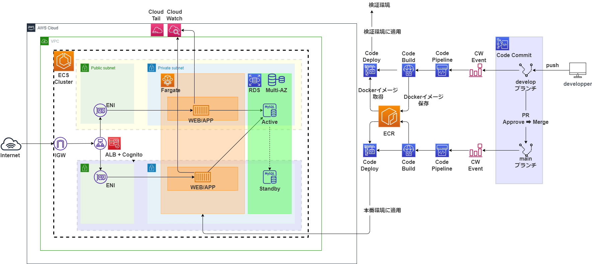

# Are you free?

## システム構成図



## ディレクトリ構造

* MVC
  + Model
    - DBとのやり取り
  + View
    - Controllerを使って情報を表示
  + Controller
    - ViewとModel間の通信を行う媒体を提供する

```shell:
.
├── README.md
├── build
│   ├── app
│   │   └── Dockerfile
│   └── db
│       ├── Dockerfile
│       └── init
│           └── create_table.sh
├── cmd
│   └── schedule
│       └── main.go
├── docker-compose.yml
├── go.mod
├── go.sum
├── internal # 外部から使われる予定のないプログラムを格納
│   ├── controllers
│   │   └── schedule.go # 全てのハンドラメソッドを持つ
│   ├── db
│   │   └── db_connection.go # DB接続メソッドを持ち、MySQL接続オブジェクトを返す
│   └── models
│       └── schedule.go # データベースとのやり取りに関連する全てのメソッドを含む
└── tmp

    └── main

```
